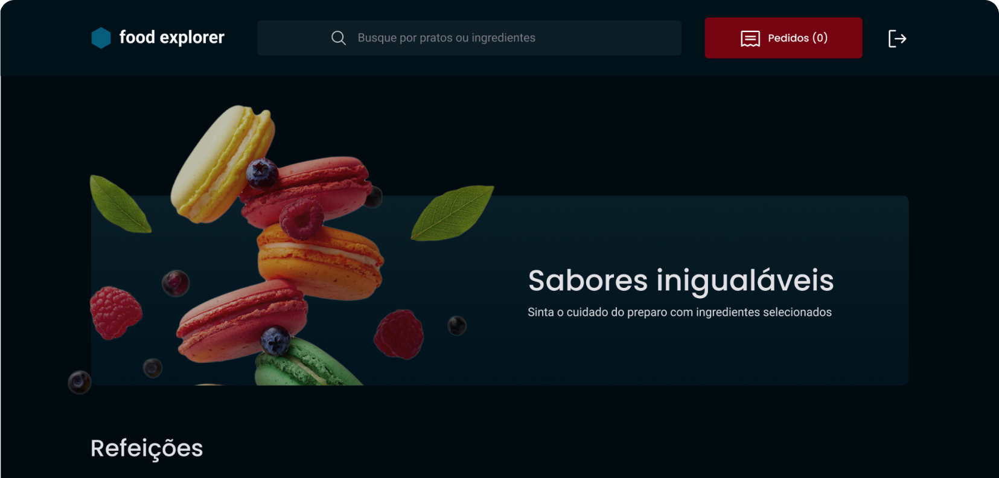

<h1 align="center"> Food_Explorer_frontend </h1>

  <a href="#-technologies">Technologies</a>&nbsp;&nbsp;&nbsp;|&nbsp;&nbsp;&nbsp;
  <a href="#-project">Project</a>

  

## 🚀 Technologies

This project was developed with the following technologies:

- Javascript
- Git and GitHub
- React
- Vite

## 💻 Project

- Food_Explorer_frontend is a frontend application dedicated to register users, dishes, ingredients.